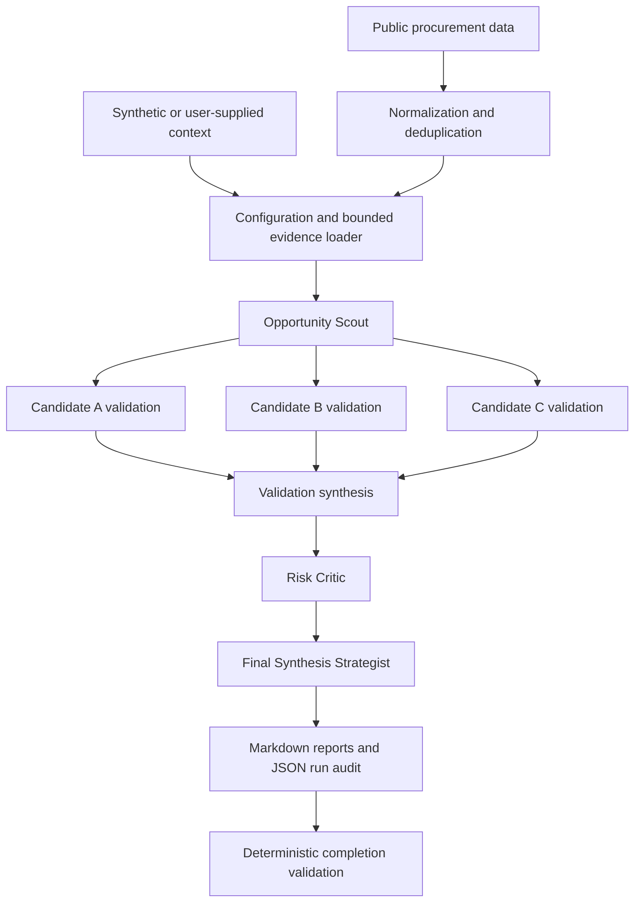

# Model Counsel

Model Counsel is a Python and CrewAI workflow for evidence-first research into
contract-supply opportunities. It coordinates specialized agents to map opportunities,
validate a three-candidate shortlist, challenge the evidence and operating assumptions, and
produce a structured decision report. The included scenario and data are synthetic; the
repository contains no private career, financial, customer, or supplier information.

## Why I Built It

Open-ended LLM research can produce attractive recommendations without proving that a buyer
actually purchases the product, that a new supplier can qualify, or that the cash cycle is
survivable. This project turns those concerns into an explicit workflow. It starts with
purchasing evidence, keeps research and critique separate, records uncertainty, and requires
completion markers and minimum evidence before later tasks may proceed.

## Architecture



The Crew uses `Process.sequential`. Planning, memory, delegation, and automatic full reruns
are disabled. CrewAI checkpointing is also disabled because CrewAI 1.15.x checkpoint
snapshots can serialize LLM credentials and complete prompt context.

## How It Works

The opportunity scout derives eight candidate verticals from procurement evidence and emits
exactly three machine-readable shortlist headings. One researcher performs a separate deep
dive for each candidate, then synthesizes the comparisons. A critic stress-tests contract
classification, qualification, competition, financing, working capital, and evidence gaps.
The strategist creates the final report without new web research.

Task guardrails check output length, source-URL counts, required sections, exact completion
markers, distinct shortlist names, and agreement between each candidate report and its
assigned shortlist position. These checks detect missing or misrouted work; they do not prove
that an LLM-generated claim is true. Human source review remains required.

## Models and API Integration

The implementation uses CrewAI, OpenAI models, Serper web search, and CrewAI's website
scraping tool. Model selection is static and role-based: worker agents share one configurable
model, while final synthesis uses a second configurable model. This is not dynamic routing.

Completion-token ceilings, iteration limits, timeouts, retry limits, and a crew-level RPM
limit constrain execution. Search allowances are prompt-level budgets rather than enforced
tool-call quotas. `TARGET_RUN_BUDGET_USD` is recorded as a planning guardrail and is not a
provider-side spending cap.

Outputs are Markdown reports plus a JSON run audit. They are structurally validated, but the
project does not use typed/Pydantic task outputs or a deterministic Python scoring engine.
Score ranges are produced by agents using criteria supplied in the context.

## Public Procurement Preparation

`model-counsel-prepare-procurement` normalizes CanadaBuys CSV exports, parses dates and money,
joins tenders to awards where possible, deduplicates amendments, preserves provenance, and
builds an agent-sized evidence sample. `model-counsel-prepare-buyers` creates a bounded buyer
universe from a Statistics Canada business-count table. Raw and processed datasets are
intentionally ignored because they are large, reproducible, and may include public contact
details unnecessary for a portfolio repository.

## Setup

Python 3.10 through 3.13 is supported.

```bash
python3.13 -m venv .venv
source .venv/bin/activate
python -m pip install -e '.[dev]'
cp .env.example .env
model-counsel check
```

For a live run, add your own `OPENAI_API_KEY` and `SERPER_API_KEY` to the untracked `.env`,
review the cost-related settings, then run:

```bash
model-counsel check --require-credentials
model-counsel run
```

Live execution can incur API charges. The repository's validation used the no-cost preflight,
unit tests, static checks, and Crew construction with placeholder credentials—not a paid
research run.

## Configuration and Safety

Start with [.env.example](.env.example). The default context is
[examples/synthetic_context.md](examples/synthetic_context.md), and the accompanying CSVs are
explicitly fictional. Generated outputs, local model state, caches, databases, raw data,
processed data, private context files, and populated environment files are ignored.

Revision mode accepts a prior completed final report through `PREVIOUS_REPORT_PATH` and
requires its completion marker. Existing outputs are archived before a new run so stale files
cannot make a failed execution appear complete. Failures produce a traceback and a JSON audit;
successful runs record package versions, model settings, limits, evidence manifests, usage
metrics, and output metadata.

## Design Decisions

- Sequential execution makes task ownership and evidence flow easier to audit.
- Separate research, criticism, and synthesis roles reduce self-confirming recommendations.
- Markdown contracts retain readable artifacts while deterministic checks catch truncation.
- Local evidence is explicitly bounded to control context size.
- Public-data preparation remains deterministic Python rather than an LLM task.
- Checkpointing is disabled to prevent secrets and full prompts from entering snapshots.

## What I Learned

The project reinforced that agent orchestration is primarily a systems problem: prompts,
context boundaries, task identity, failure detection, evidence provenance, and operational
limits matter as much as model choice. It also highlighted the gap between syntactic
completion and factual validation, and the importance of treating cost targets and prompt
instructions honestly when they are not provider-enforced controls.

## Future Improvements

Useful next steps include mock-based Crew integration tests, hard tool-call accounting,
provider-side budget alerts, typed internal handoff schemas, configurable research templates,
and stronger citation verification. Those capabilities are not claimed by the current code.

## AI Assistance

I designed the workflow, agent responsibilities, evaluation criteria, and system behavior,
and used AI coding assistants to help implement and iterate on portions of the code. I tested,
debugged, and adapted the resulting system against real use cases.
